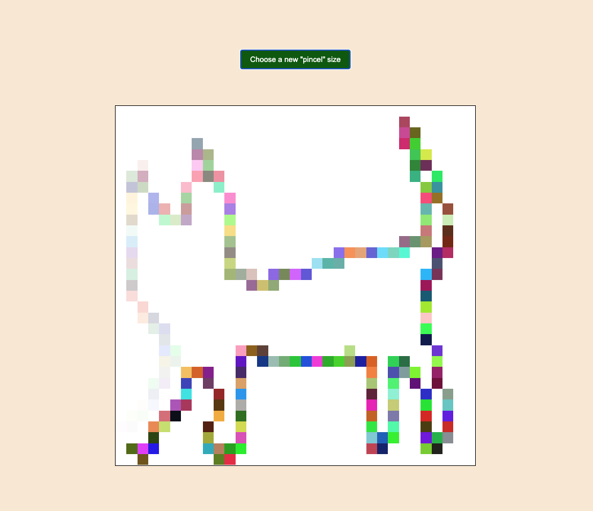

# Dynamic Grid Generator

This project creates a responsive grid layout using Flexbox, where the number of cells and their size can be dynamically adjusted using JavaScript. Each cell's width and height are calculated based on the grid size.

## Features

- Dynamic grid size: Adjust the number of cells by changing the `gridSize` variable in the JavaScript file.
- Responsive layout: The grid adapts to different screen sizes.
- Flexbox layout: Uses Flexbox to align and position the grid cells within a container.

## Technologies Used

- **HTML5**: Structure and markup.
- **CSS3**: Styling and layout using Flexbox.
- **JavaScript**: Grid generation and dynamic styling.